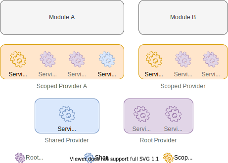

# Service

在 bizic.js 中，Service 是一个很宽泛的定义，一段业务逻辑、一个日志工具方法，都可以作为一个 Service。

在整个 bizic.js 中，Service 与 Provider 的关系大概如下：



## 注册 Service

在使用过程中，我们需要提前注册 Service，注册 Service 的方式就是提供一个 Service Factory。bizic.js 会根据 Service 的使用时机，通过 Service Factory 创建一个 Service 实例。

Service Factory 可以是一个工厂函数，如：

```js
function loggerFactory() {
  const logger = {
    info(...args) {
      console.log(...args);
    }
  };
  return logger;
}

// 注册 Service
bizic.registerServiceFactory('logger', loggerFactory);
```

也可以是一个实现了 `create` 静态方法的工具类，如：

```js

export default class Logger {
  static create(...args) {
    return new this(...args);
  }
  info(...args) {
    console.log(...args);
  }
}

// 注册 Service
bizic.registerServiceFactory('logger', loggerFactory);

```

其中，bizic.js 提供了一个 `Service` 基类，如下：

```js 
import { Service } from 'bizic';

export default class Logger extends Service {
  info(...args) {
    console.log(...args);
  }
}

// 注册 Service
bizic.registerServiceFactory('logger', loggerFactory);

```

开发者可以直接继承这个基类，也可以使用前面两种方式声明 Service Factory。

## Service 类型

Service 主要包含一下三种类型：

- Root Service，在 Root Provider 可以获取到 Service，相对于 app 实例是单例的。
- Scoped Service，在对应的 Scoped Provider 可以获取到的 Service，相对于对应的 Scoped  Provider，是单例的。
- Shared Service，多个 Scoped Provider 共享的 Service，于第一次使用时创建，相对于 app 是单例的。

### Root Service

通过 `bizic.registerServiceFactory(serviceName, factory)` 可以注册一个 Root Service，参数如下：
- `serviceName`: Service 的名称，在使用 Service 时，可以通过这个名称获取到对应的 Service 实例。
- `factory`: Service Factory。

### Scoped Service

通过 `bizic.registerScopedServiceFactory(scopeId, serviceName, factory)` ，参数如下：

- `scopeId`: Scoped Provider 的 Id，只有在对应的 Scoped Provider 中才可以获取到 Service 实例
- `serviceName`: Service 的名称，在使用 Service 时，可以通过这个名称获取到对应的 Service 实例。
- `factory`: Service Factory。

示例如下：

?>Todo

### Shared Service

通过 `bizic.registerSharedServiceFactory(scopeIds, serviceName, factory)` ，参数如下：

- `scopeIds`: Scoped Provider 的 id 列表，只有在对应的 Scoped Provider 中才可以获取到 Service 实例
- `serviceName`: Service 的名称，在使用 Service 时，可以通过这个名称获取到对应的 Service 实例。
- `factory`: Service Factory。

示例录下：

?> TODO

## 使用 Service

我们可以在一个组件中使用 service，也可以在一个 service 中使用另一个 service

### 组件中
在组件中，可以通过 `useService(serviceName)`，如：

```vue
<template>
  <h1>{{ foo.bar }}</h1>
</template>

<script>
import { useService } from 'bizic-vue';

export default {
  name: 'App',
  components: {
    HelloWorld,
  },
  setup() {
    // 使用 service
    const foo = useService('foo');
    return { foo };
  },
};
</script>
```
### Service 中
在 Service 中，通过 `inject(serviceName)` 注入依赖的 Service 示例，如

```js
import { inject } from 'bizic';
import { Observable } from 'bizic-reactivity-vue';

export default class AboutStore extends Observable {
  // 注入了 logger 实例
  logger = inject('logger');

  name = 'Bizic';

  loadData() {
    this.logger.info('data loaded');
  }
}
```
!> 注意：`inject()` 只能在构造函数或者静态属性声明赋值时使用。

### Service 的依赖关系

**Root Service:** 
1. 一个 `Root Service` 可以依赖另一个 `Root Service`;
2. 不能形成循环依赖；

**Scoped Service:**
1. `Scoped Service` 可以依赖 `Root Service`；
2. 一个 `Scoped Service` 可以依赖同一个 Scoped 下的另一个 `Scoped Service`；
3. `Scoped Service` 间不能形成循环依赖；

**Shared Service:**
1. `Shared Service` 可以依赖 `Root Service`；

### Service 的生命周期

`Service` 的生命周期与对应的 `Provider` 保持一致，在第一次使用时被实例化，在同一个 `Provider` 中是单例的，跟随 `Provider` 的销毁而销毁。